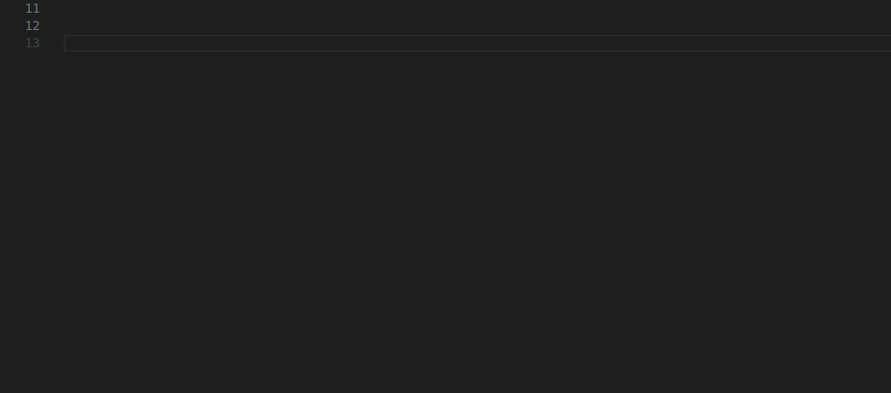
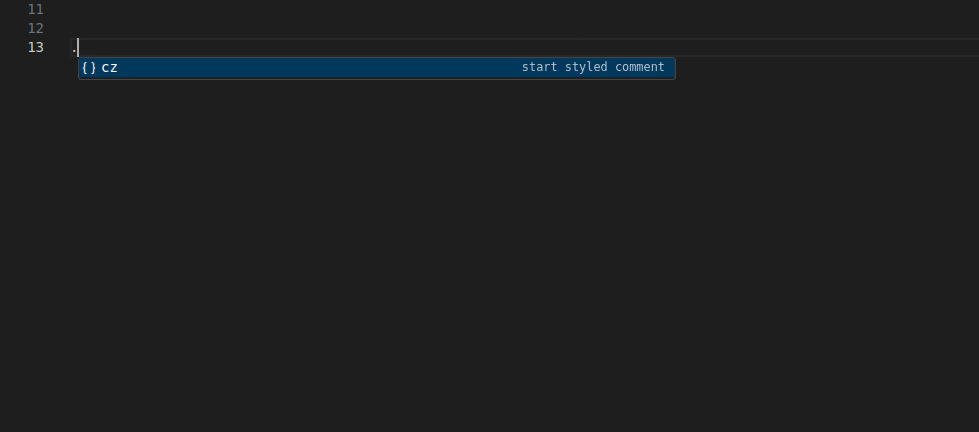
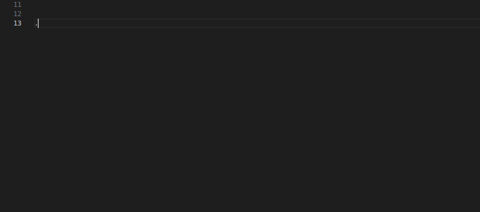
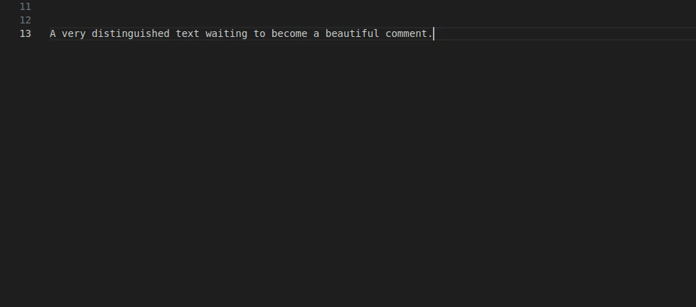

# CommentZ (zee)
stupid little commenting extension, made primarily to learn extension development

# Features
- suggestion based comment creation

- wrap for long comments

- commenting options (very usefull i guess)

- context menu commands

# Languages
- python
- c
- cpp
- javascript
- typescript